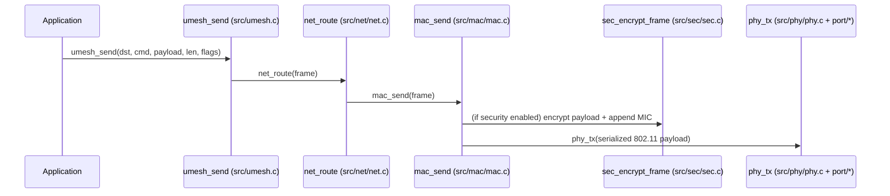
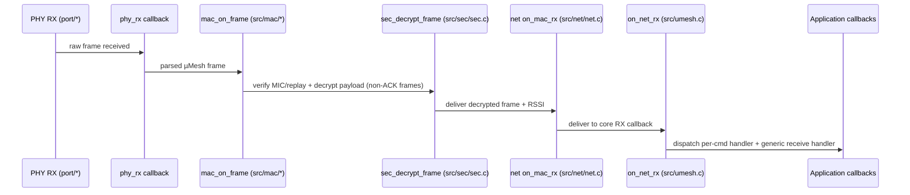
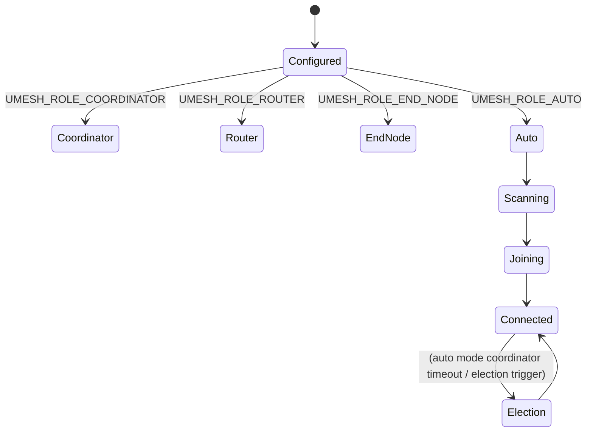
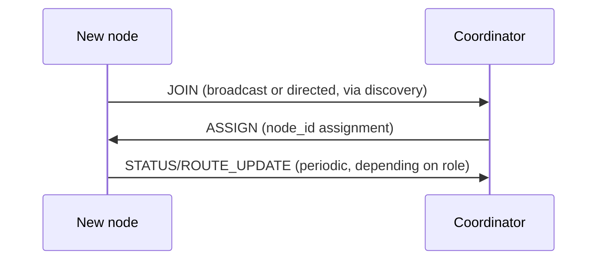
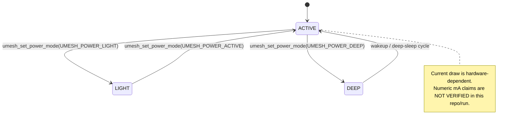

# Diagrams (Mermaid)

Diagrams in this file are derived from the current code structure (`src/`, `port/`, `include/`). If a diagram shows a conceptual step that is not enforced by code, it is labeled explicitly.

## A) High-level stack (code structure)

```mermaid
flowchart TB
  app[Application code] --> api[Public API<br/>include/umesh.h]
  api --> core[src/umesh.c]

  core --> net[src/net/*]
  core --> sec[src/sec/*]
  net --> mac[src/mac/*]
  mac --> phy[src/phy/*]

  phy --> port_sel{Port selection}
  port_sel -->|ESP32| esp32[port/esp32/phy_esp32.c<br/>esp_wifi_80211_tx + promiscuous RX]
  port_sel -->|POSIX (testing)| posix[port/posix/phy_posix.c<br/>loopback simulation]
```

## B) TX flow (verified by code inspection)



## C) RX flow (partly conceptual; see note)



## D) Node roles (implemented)



## E) Discovery / join flow (implemented; simplified)



## F) Routing (implemented)

```mermaid
flowchart TB
  send[net_route(frame)] --> mode{routing mode}
  mode -->|Distance-vector| dv[net_route_distance_vector()]
  mode -->|Gradient & dst==COORDINATOR| gr[neighbor_find_uphill()]
  dv --> mac[mac_send(frame)]
  gr --> mac
```

## G) Power modes (implemented as API; measurements NOT VERIFIED)


